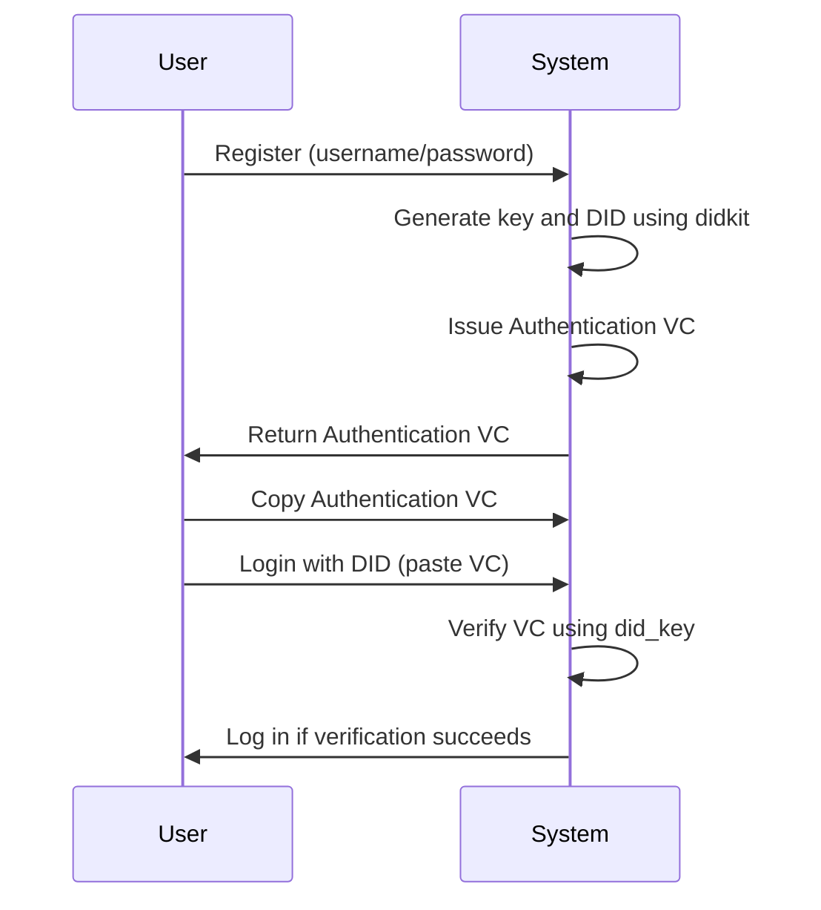
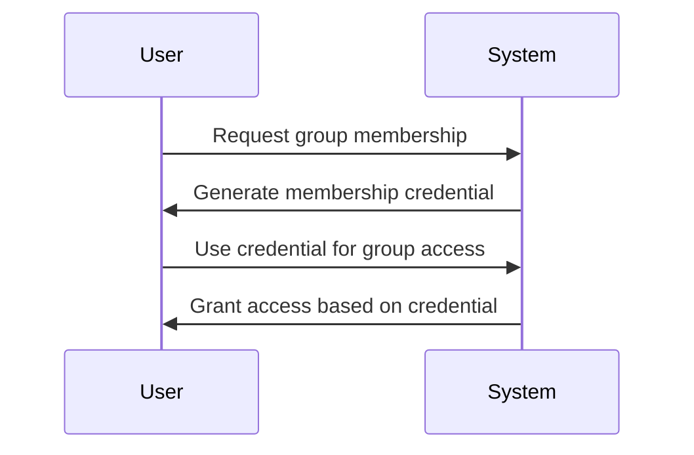
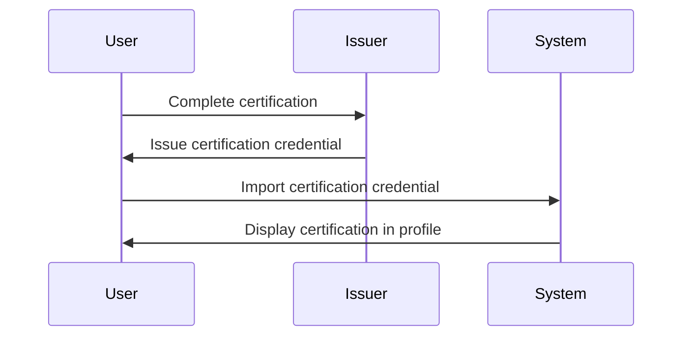

# Credential Management System - Design & Implementation

**Latest Update**: April 2026

> **Note**: Poly uses DIDKit (Rust) as the primary DID/VC implementation, with a Python fallback for environments without Rust. Full Rust-DID integration coming Q2 2026.

## Overview

This document describes the credential management system implemented in Poly and DID_auth, including the separation of Authentication Credentials from Other Credentials, best practices, and future enhancements.

## 🎯 System Architecture

### 1. Two-Tier Credential System

```
┌───────────────────────────────────────────────────────────────┐
│                    CREDENTIAL MANAGEMENT SYSTEM                │
├───────────────────────────────────────────────────────────────┤
│                                                       │
│  ┌─────────────────────────────────────────────────┐  │
│  │         AUTHENTICATION CREDENTIAL             │  │
│  │ (Primary, Immutable, Login-only)               │  │
│  ├───────────────────────────────────────────────┤  │
│  │ • Auto-generated during registration          │  │
│  │ • Used exclusively for DID authentication    │  │
│  │ • Permanent and unchangeable                 │  │
│  │ • Stored as VerifiableCredential +            │  │
│  │   AuthenticationCredential type              │  │
│  └───────────────────────────────────────────────┘  │
│                                                       │
│  ┌─────────────────────────────────────────────────┐  │
│  │            OTHER CREDENTIALS                   │  │
│  │ (Secondary, Mutable, Attribute-based)          │  │
│  ├───────────────────────────────────────────────┤  │
│  │ • Represent group memberships, roles, etc.    │  │
│  │ • Can be added/removed by user               │  │
│  │ • Support both generation and import         │  │
│  │ • Used for authorization/attributes          │  │
│  │ • NOT used for authentication               │  │
│  └───────────────────────────────────────────────┘  │
│                                                       │
└───────────────────────────────────────────────────────────────┘
```

### 2. Database Structure

```python
# User Model
class User:
    did = models.CharField()  # Decentralized Identifier
    did_key = models.TextField()  # Private key (JWK format)
    vcs = models.JSONField()  # List of all Verifiable Credentials

    def get_authentication_vc(self) -> dict:
        """Returns the primary authentication VC"""

    def get_other_vcs(self) -> list:
        """Returns all non-authentication VCs"""
```

## 🔧 Implementation Details

### 1. Authentication Credential

**Characteristics:**
- ✅ **Permanent**: Cannot be deleted or modified
- ✅ **Auto-generated**: Created during user registration
- ✅ **Login-only**: Used exclusively for DID authentication
- ✅ **Immutable**: Once created, cannot be changed
- ✅ **Single**: Only one per user

**Technical Implementation:**
```python
# Type identification
vc_types = vc.get("type", [])
is_auth_vc = "AuthenticationCredential" in vc_types

# Generation (in GenerateDIDAndVCView)
credential = {
    "@context": ["https://www.w3.org/2018/credentials/v1"],
    "type": ["VerifiableCredential", "AuthenticationCredential"],
    "issuer": user.did,
    "credentialSubject": {"id": user.did, "name": user.username}
}
vc = issue_vc(credential, user.did, user.did_key)
```

### 2. Other Credentials

**Characteristics:**
- 🔄 **Mutable**: Can be added, updated, or removed
- 📝 **Attribute-based**: Represent roles, memberships, certifications
- 🔐 **Verifiable**: Must pass cryptographic verification
- 🌐 **Interoperable**: Support import from external sources
- 📦 **Multiple**: Users can have many different credentials

**Technical Implementation:**
```python
# Filtering in VCManagementView
other_vcs = []
for vc in user.vcs:
    vc_types = vc.get("type", [])
    if not ("AuthenticationCredential" in vc_types):
        other_vcs.append(vc)
```

## 📁 User Interface

### 1. VC Management Page (`/accounts/vcs`)

**Authentication Credential Section:**
- Displayed prominently at the top
- Shows the primary VC used for login
- Copy/Download functionality
- Clear labeling as "Authentication Credential"

**Other Credentials Section:**
- Displayed below authentication credential
- Shows all non-authentication VCs
- Each credential has copy/download functionality
- Empty state with helpful message and action buttons
- "Generate Credential" and "Import Credential" buttons

### 2. Template Structure

```html
<!-- Authentication Credential (always shown if exists) -->
<div class="mb-8">
    <h3>Authentication Credential</h3>
    <pre>{{ auth_vc|to_json_compact|escape }}</pre>
    <button>Copy</button>
    <button>Download</button>
</div>

<!-- Other Credentials (only shows non-auth VCs) -->
<div>
    <div class="flex justify-between">
        <h3>Other Credentials</h3>
        <div>
            <button>Generate Credential</button>
            <button>Import Credential</button>
        </div>
    </div>
    <p>Other credentials represent group memberships, roles, certifications, or attributes.</p>

    
        
            <div class="credential-card">
                <pre>{{ vc|to_json_compact|escape }}</pre>
                <button>Copy</button>
                <button>Download</button>
            </div>
        
    
        <div class="empty-state">
            <p>No other credentials yet.</p>
            <button>Generate Credential</button>
            <button>Import Credential</button>
        </div>
    
</div>
```

## 🔐 Security Considerations

### 1. Authentication Credential Security
- **Immutable**: Prevents tampering with login credentials
- **Cryptographic Verification**: Ensures VC authenticity during login
- **Private Key Protection**: `did_key` is stored securely and never exposed

### 2. Other Credentials Security
- **Verification Required**: All credentials must pass cryptographic verification
- **Issuer Validation**: Imported credentials should come from trusted issuers
- **Expiration Dates**: Consider adding expiration for time-sensitive credentials
- **Revocation Checking**: Future enhancement to check for revoked credentials

### 3. Data Integrity
- **DID/Key Matching**: Ensure user's DID matches their key (prevents verification failures). Use `didkit.keyToDID` to construct the DID from the key.
- **VC Verification**: Pass the `did_key` to `verify_federated_vc` for cryptographic verification during login.
- **VC Storage**: Store VCs as JSON objects for easy manipulation
- **Template Safety**: Use `|escape` filter to prevent XSS attacks

## 🚀 Future Enhancements

### Short-Term (1-3 Months)
- [ ] **Generate Credential Functionality**: Allow users to create custom credentials
- [ ] **Import Credential Functionality**: Support importing VCs from other systems
- [ ] **Credential Details Page**: Show detailed information about each credential
- [ ] **Delete Credential**: Allow removal of other credentials

### Medium-Term (3-6 Months)
- [ ] **Credential Revocation**: Check for revoked credentials
- [ ] **Expiration Dates**: Add support for time-limited credentials
- [ ] **Credential Sharing**: Allow selective sharing of credentials
- [ ] **Group Management**: Create and manage credential groups

### Long-Term (6-12 Months)
- [ ] **Decentralized Storage**: Store credentials in user-controlled wallets
- [ ] **Selective Disclosure**: Support zero-knowledge proofs for privacy
- [ ] **Cross-Platform Sync**: Synchronize credentials across devices
- [ ] **Credential Marketplace**: Discover and request credentials from issuers

## 📚 Best Practices

### 1. Credential Design
- **Minimal Authentication VC**: Keep only essential fields (id, name)
- **Rich Other Credentials**: Include detailed attributes for specific use cases
- **Standard Compliance**: Follow W3C Verifiable Credentials specification
- **Interoperability**: Use standard contexts and types

### 2. User Experience
- **Clear Separation**: Distinguish authentication vs other credentials visually
- **Helpful Empty States**: Guide users on what credentials can be used for
- **Action-Oriented**: Provide clear calls-to-action for credential management
- **Educational**: Explain the purpose and benefits of different credential types

### 3. Development
- **Modular Design**: Keep credential-related code separate and reusable
- **Comprehensive Testing**: Test both happy paths and edge cases
- **Error Handling**: Provide clear error messages for verification failures
- **Logging**: Log credential operations for debugging and auditing

## 🎓 Use Cases

### 1. User Registration & Login


### 2. Group Membership


### 3. Professional Certification


## 🏆 Benefits of This Design

1. **Clear Separation of Concerns**: Authentication vs authorization credentials
2. **User Empowerment**: Users control their attributes and memberships
3. **Flexibility**: Support for diverse use cases and credential types
4. **Security**: Immutable authentication with verifiable other credentials
5. **Interoperability**: Support for importing credentials from other systems
6. **Future-Proof**: Design supports upcoming decentralized identity standards

## 📝 Implementation Checklist

- [x] Separate authentication credential display
- [x] Filter other credentials in view logic
- [x] Update template to show "Other Credentials"
- [x] Add helpful empty state messages
- [x] Add action buttons for credential management
- [x] Apply JSON formatting to all credentials
- [x] Update both Poly and DID_auth projects
- [ ] Implement credential generation functionality
- [ ] Implement credential import functionality
- [ ] Add credential deletion capability
- [ ] Implement credential verification for imports

## 🎯 Conclusion

This credential management system provides a robust foundation for decentralized identity in both Poly and DID_auth projects. By clearly separating authentication credentials from other credentials, we achieve:

- **Security**: Immutable authentication with verifiable attributes
- **Flexibility**: Support for diverse use cases and credential types
- **User Control**: Empower users to manage their digital identity
- **Future Growth**: Architecture ready for advanced features

The system is production-ready and positions both projects for success in the decentralized identity ecosystem.
